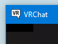

### XXXHaptics: A fucking guide to VRChat

## Required:

-   Virtual Reality Headset supported by VRChat
-   VRChat account with rank of “New User”
-   Any toy registered on buttplug.io
-   Unity 2018.4.20f1 (As of June 2020)
-   VRChat SDK2 (As of June 2020)
-   A computer with built-in Bluetooth OR Plugable USB Bluetooth 4.0 Low Energy Micro Adapter
-   USB Extension Cable/Dongle highly recommended
-   XXXHaptics
-   itiface Desktop
-   Notepad++
-   Lube

## Important Links:

-   <https://hheaven.net/XXXHaptics/manual.html>
-   <http://hheaven.net/XXXHaptics/XXXHaptics.zip>
-   <https://intiface.com/desktop/>
-   <https://github.com/intiface/intiface-desktop>
-   <https://discord.buttplug.io/>
-   <https://buttplug.io/>
-   <https://www.patreon.com/qdot>
-   <https://playground.buttplug.world/>
-   <https://vrchat.com/>
-   <https://docs.vrchat.com/>
-   <https://docs.vrchat.com/docs/controls>
-   <https://docs.vrchat.com/docs/current-unity-version>
-   <https://github.com/madjin/awesome-vrchat>
-   <https://vrchat.fandom.com/wiki/List_of_model_resource_websites>
-   <https://notepad-plus-plus.org/>
-   <https://www.amazon.com/Plugable-Bluetooth-Adapter-Raspberry-Compatible/dp/B009ZIILLI>

## Part 1: Notes

-   Support buttplug.io via Patreon
-   Feel free to share this Guide with anyone
-   Make sure Bluetooth Drivers are up to date
-   XXXHaptics.exe might set off your antivirus
-   Be safe, know your limits, and always use plenty of lube
-   Join the buttplug.io Discord for more advanced questions
-   This software does not modify the VRChat client in any way
-   Log into the VRChat website first before downloading the SDK

## Part 2: Intiface Desktop Setup

A. Launch Intiface Desktop installer and run GET UPDATES

B.  Do not run RUN CERTSETUP

C.  Settings -\> Server Process Settings -\> Check “Start Server when Intiface Desktop Launches”

## Part 3: Unity Setup 

### **THIS IS NOT INTENDED TO BE AN AVATAR CREATION GUIDE AND ASSUMES YOU HAVE AT LEAST SOME BASIC KNOWLEDGE ABOUT BOTH UNITY AND AVATAR CREATION. PLEASE REFER TO THE IMPORTANT LINKS SECTION FOR THE APROPREATE RESOURCES**

A.  Go to the Layer Dropdown Menu at the top of the Inspector tab and click Add Layer…

B.  Make sure your Tags & Layers are set up correctly

C.  Import XXXHaptics.unitypackage and add XXXHaptics/prefab/Haptics.prefab as a child of Neck

D.  Break Prefab instance

E.  Place HapticsSensor_X_X on desired locations on the Armature Tree

F.  Move HapticsSensor_X_X to desired location within the 3D Scene

G.  Update HapticsSensor_X_X to match with these settings

H.  Bonus: Change HapticsSensor_X_X Size

I.  Bonus: Change HapticsSensor_X_X Culling Masks

J.  DO NOT UPLOAD AS PUBLIC/SHARE THE AVATAR IT WILL BREAK REQUIRING A REUPLOAD

## Part 4: XXXHaptics Setup

A.  Plug adapter in or enable built-in Bluetooth

B.  Connect toy to computer via Bluetooth

C.  Open playground.buttplug.world and connect via browser or Intiface

D.  Record Toy name IE “Lovense Hush v222”

E.  Right click “setting.json” -\> “Edit with Notepad++” or your preferred text editor

F.  Change [XXXXX] to your Toy’s name

G.  Edit the code based on your Toy/Avatar configuration and save the .json file

## Part 5: Testing

A.  Launch VRChat and start Stream Camera by opening the Menu -\> Camera -\>Stream Camera

B.  Set Camera to self-gaze mode

C.  Bonus: Detach screen from lens

D.  Load into modified Avatar, at the top left you should see 4 black boxes

E.  Start Intiface Desktop and click START SERVER if autostart is disabled [See1.E]

F.  Launch XXXHaptics

G.  If everything is set up correctly the Toy should connect and react to collisions with the Sensors

